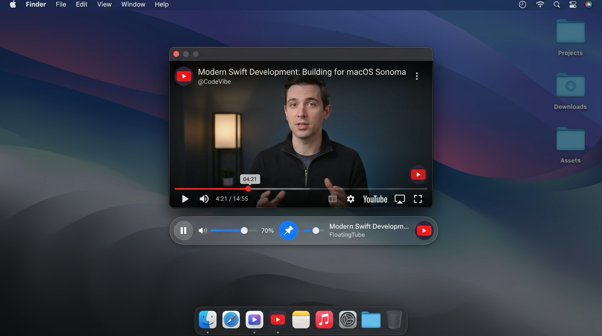

🇰🇷 [한국어](README.md) | 🇺🇸 [English](README.en.md) | 🇯🇵 [日本語](README.ja.md) | 🇨🇳 [中文](README.zh.md)

<p align="center">
  
</p>

<h1 align="center">📺 FloatingTube</h1>

<p align="center">
  <b>Lightweight Floating YouTube Player for macOS</b><br/>
  <i>Always-on-Top Floating YouTube Player with In-App Fullscreen & Click-Through Mode</i>
</p>

<p align="center">
  <a href="https://swift.org"></a>
  <a href="https://apple.com/macos"></a>
  <a href="https://github.com/mrKangHo/FloatingTube/releases/latest"></a>
  <a href="LICENSE"></a>
</p>

<p align="center">
  <a href="https://github.com/mrKangHo/FloatingTube/releases/latest/download/FloatingTube-v1.1.0-macos.zip">
    
  </a>
</p>

<p align="center">
  
</p>

<div align="center">
<b>Watch YouTube effortlessly while coding, designing, writing documents, or browsing without covering your workspace.</b><br/>
Going far beyond basic Picture-in-Picture (PiP) limitations, FloatingTube provides <b>Window-Confined In-App Fullscreen</b>, <b>Mouse Click-Through Mode</b>, <b>macOS Status Bar Tray Control</b>, <b>Login Persistence</b>, and a native macOS experience.
</div>

---

## 📥 Installation

### Homebrew
```bash
brew tap mrKangHo/tap
brew install floatingtube
```

### Direct Download

You can use the latest pre-built application directly:

1. Click **[📥 Download FloatingTube (FloatingTube-v1.1.0-macos.zip)](https://github.com/mrKangHo/FloatingTube/releases/latest/download/FloatingTube-v1.1.0-macos.zip)**.
2. Unzip the downloaded `FloatingTube-v1.1.0-macos.zip` file.
3. Drag and drop **`FloatingTube.app`** into your **`/Applications`** folder.
4. Double-click to open and enjoy!

---

## 🌟 Key Features

### 1. 📌 Always on Top
* The floating player stays on top of all other application windows on your screen.
* Quickly toggle pinning via <kbd>⌘</kbd> + <kbd>T</kbd> or from the status bar menu.

### 2. 🎬 Window-Confined In-App Fullscreen
* **Does NOT take over your entire desktop space**: Preserves your chosen floating window dimensions (e.g. `340 × 200`, `512 × 288`).
* Clicking the YouTube player's fullscreen button (`[ ]`) or pressing <kbd>F</kbd> hides comments, sidebar, and headers, expanding the video to fill 100% of the floating window container.
* Pressing <kbd>Esc</kbd> or <kbd>F</kbd> instantly returns to the full YouTube web layout with comments.

### 3. 🖱️ Mouse Click-Through Mode
* Press <kbd>⌘</kbd> + <kbd>⇧</kbd> + <kbd>C</kbd> to pass all mouse clicks and scrolls directly to windows behind FloatingTube.
* **100% Concealed Controls**: While Click-Through mode is active, both the FloatingTube HUD and YouTube's internal controls/gradients are completely hidden, leaving only the pure video playing unobtrusively.

### 4. 🌐 Clean Mode vs. Web View Mode
* **Clean Mode**: Minimalist view focused solely on the video without recommendations or distractions.
* **Web View Mode**: Full YouTube website view allowing you to read comments, view playlists, and browse recommended videos.

### 5. 🖥️ macOS Status Bar (Menu Bar Extra) Tray
* A lightweight icon resides in your top-right macOS menu bar (next to clock / Wi-Fi) providing one-click access to all playback, opacity, and window controls.

### 6. 👤 Google & YouTube Login Session Persistence
* Leverages persistent WebKit storage (`WKWebsiteDataStore.default()`), keeping your subscriptions, playlist history, and personalized recommendations intact across restarts.

### 7. 📐 16:9 Aspect Ratio Lock & 💧 Opacity Adjustment
* Free-form window resizing with automatic 16:9 widescreen aspect ratio snapping.
* Adjustable transparency from 30% to 100% to let you see underlying content easily.

### 8. 📋 Quick Clipboard Paste & Play
* Copy any YouTube URL from your browser and press <kbd>⌘</kbd> + <kbd>V</kbd> to start playing immediately.

---

## ⌨️ Keyboard Shortcuts

| Shortcut | Action | Description |
|:---:|---|---|
| <kbd>⌘</kbd> + <kbd>V</kbd> | **Play Clipboard Link** | Automatically parse and load YouTube URL from clipboard |
| <kbd>⌘</kbd> + <kbd>T</kbd> | **Toggle Always on Top** | Pin / unpin player above other windows |
| <kbd>⌘</kbd> + <kbd>⇧</kbd> + <kbd>C</kbd> | **Click-Through Mode** | Pass clicks through player & completely hide controls |
| <kbd>F</kbd> or <kbd>T</kbd> | **In-App Fullscreen** | Expand video to fill floating window container |
| <kbd>Esc</kbd> | **Exit Fullscreen** | Restore comments and web sidebar layout |
| <kbd>Space</kbd> | **Play / Pause** | Toggle video playback |
| <kbd>M</kbd> | **Mute / Unmute** | Toggle audio mute |
| <kbd>⌘</kbd> + <kbd>R</kbd> | **Reload** | Refresh current video stream |
| <kbd>⌘</kbd> + <kbd>Q</kbd> | **Quit** | Exit FloatingTube |

---

## 🛠️ Build & Development

### Requirements
* macOS 13.0 (Ventura) or later
* Apple Silicon (M1/M2/M3/M4) or Intel x86_64 Mac
* Swift 5.9+ / Xcode 15.0+ / Tuist 4.x+

### Generate Xcode Project with Tuist (Recommended)
```bash
# 1. Clone repository
git clone https://github.com/mrKangHo/FloatingTube.git
cd FloatingTube

# 2. Generate Xcode workspace using Tuist
./scripts/generate_project.sh
# or directly: tuist generate

# 3. Run all unit tests
./scripts/run_tests.sh

# 4. Open FloatingTube.xcworkspace and build/run directly in Xcode
```

### Build via Script (CLI)
```bash
# Build release bundle
chmod +x scripts/bundle_app.sh
./scripts/bundle_app.sh

# Launch application
open FloatingTube.app
```

---

## 🏗️ Clean Architecture & Modules

FloatingTube is structured with **Clean Architecture** principles and modularized via **Tuist**:

* **`FloatingTubeDomain`**: Pure business models (`YouTubeTarget`, `PlayHistoryItem`, `WindowPreferences`), UseCases (`ResolveYouTubeTargetUseCase`, `ManageHistoryUseCase`, `PasteAndResolveUseCase`), and repository contracts.
* **`FloatingTubeData`**: Concrete implementations of repositories and system services (`UserDefaultsHistoryRepository`, `UserDefaultsPreferencesRepository`, `NSPasteboardService`).
* **`FloatingTubePresentation`**: UI layer featuring SwiftUI views, `AppState` ViewModel, `WindowManager`, and localizations.
* **`FloatingTube` (App Target)**: Application entry point (`@main`), composition root (`AppDIContainer`), menu bar item, and bundled resources.

---

## 📄 License

This project is licensed under the [MIT License](LICENSE).  
Feel free to use, modify, and distribute for personal or commercial projects.

<br/>

<div align="center">
Made with ❤️ by <a href="https://github.com/mrKangHo">mrKangHo</a>
</div>
