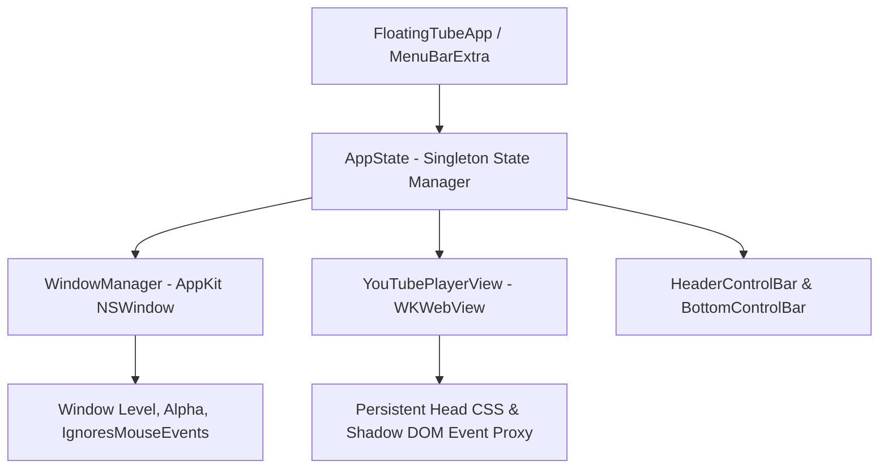

<div align="center">

# 📺 FloatingTube

### **macOS 전용 초경량 플로팅 유튜브 플레이어**
*Always-on-Top Floating YouTube Player with In-App Fullscreen & Click-Through Mode*

[ 🇰🇷 한국어 ](README.md) | [ 🇺🇸 English ](README.en.md)

<br/>

[](https://swift.org)
[-000000.svg?style=flat&logo=apple&logoColor=white)](https://apple.com/macos)
[](https://github.com/mrKangHo/FloatingTube/releases/latest)
[](LICENSE)

<br/>

<a href="https://github.com/mrKangHo/FloatingTube/releases/latest/download/FloatingTube-v1.0.0-macos.zip">
  
</a>

<br/><br/>

**코딩, 디자인, 문서 작업, 웹 서핑 중에도 작업 화면을 가리지 않고 유튜브를 자유롭게 감상하세요.**  
기본 PiP(화면 속 화면)의 제한을 뛰어넘어, **창 크기 맞춤 전체화면**, **마우스 관통 모드**, **상태표시줄 제어**, **로그인 유지** 등 완벽한 멀티태스킹 환경을 제공합니다.

</div>

---

## 📥 간편 다운로드 및 설치 (Download & Install)

소스를 직접 빌드하지 않고 완성된 최신 앱을 바로 사용하실 수 있습니다:

1. **[📥 최신 버전 다운로드 (FloatingTube-v1.0.0-macos.zip)](https://github.com/mrKangHo/FloatingTube/releases/latest/download/FloatingTube-v1.0.0-macos.zip)** 링크를 클릭하여 다운로드합니다.
2. 다운로드된 `FloatingTube-v1.0.0-macos.zip`의 압축을 풉니다.
3. 압축 해제된 **`FloatingTube.app`**을 **응용 프로그램(Applications)** 폴더로 드래그하여 이동합니다.
4. 앱을 더블 클릭하여 실행합니다.

---

## 🌟 주요 핵심 기능 (Key Features)

### 1. 📌 항상 화면 위에 고정 (Always on Top)
* 어떤 앱을 사용하든 플로팅 창이 최상단에 상시 유지됩니다.
* 단축키 `⌘ + T` 또는 상태표시줄 메뉴에서 원클릭으로 고정/해제가 가능합니다.

### 2. 🎬 창 맞춤 인앱 전체화면 (Window-Confined Fullscreen)
* **데스크톱 전체화면으로 넘어가지 않습니다**: 사용자가 설정한 플로팅 창 크기(예: `340 × 200`, `512 × 288`)를 그대로 유지합니다.
* 유튜브 플레이어의 전체화면 버튼(`[ ]`) 또는 `F` 키를 누르면, **창 내부에서 댓글/사이드바/헤더를 모두 숨기고 오직 영상 플레이어만 창 크기에 100% 꽉 차게 전환**됩니다.
* `Esc` 또는 `F` 키를 누르면 댓글과 추천 영상이 있는 원래 웹 화면으로 즉시 복귀합니다.

### 3. 🖱️ 마우스 관통 모드 (Click-Through Mode)
* 단축키 `⌘ + ⇧ + C`를 누르면 창이 완전히 마우스 이벤트를 통과시킵니다.
* **유튜브 자체 컨트롤러 & 앱 메뉴바 100% 은폐**: 관통 모드 중에는 마우스가 올라가도 플레이어 컨트롤러가 일절 나타나지 않아 뒤쪽 화면의 텍스트나 버튼을 아무런 방해 없이 클릭/스크롤할 수 있습니다.

### 4. 🌐 클린 뷰 & 웹 뷰 모드 자유 전환
* **클린 뷰 (Clean Mode)**: 방해 요소 없이 오직 영상만 미니멀하게 감상하는 모드입니다.
* **유튜브 웹 뷰 (Web Mode)**: 유튜브 원본 사이트 그대로 댓글 작성, 추천 영상 탐색, 플레이리스트 확인이 가능한 모드입니다.

### 5. 🖥️ macOS 상단 상태표시줄(Status Bar) 트레이 완벽 지원
* 화면 맨 위 우측 메뉴바(시계 옆)에 상주하는 트레이 아이콘을 통해 모든 부가 기능과 제어를 손쉽게 관리할 수 있습니다.
* 플로팅 창 위의 번잡한 버튼들을 모두 정리하여 극도로 깔끔한 화면을 유지합니다.

### 6. 👤 구글 / 유튜브 계정 로그인 유지
* macOS 전용 영구 쿠키 및 세션 저장소(`WKWebsiteDataStore.default()`)를 활용하여 구독 채널, 알고리즘 맞춤 추천, 시청 기록이 그대로 유지됩니다.

### 7. 📐 16:9 화면비율 잠금 & 💧 투명도 조절
* 모서리를 드래그해 자유롭게 창 크기를 조절해도 16:9 황금 비율을 자동으로 유지합니다.
* 30% ~ 100% 투명도 조절을 지원하여 중요한 작업 화면 뒤의 내용을 은은하게 투과하여 볼 수 있습니다.

### 8. 📋 클립보드 빠른 재생 (Paste & Play)
* 브라우저에서 유튜브 링크를 복사한 후 `⌘ + V`를 누르면 즉시 해당 영상이 로딩되어 재생됩니다.

---

## ⌨️ 단축키 안내 (Keyboard Shortcuts)

| 단축키 | 기능 | 설명 |
|:---:|---|---|
| <kbd>⌘</kbd> + <kbd>V</kbd> | **클립보드 링크 재생** | 클립보드에 복사된 유튜브 URL 또는 영상 ID 즉시 로드 |
| <kbd>⌘</kbd> + <kbd>T</kbd> | **항상 위에 고정 토글** | 최상단 플로팅 켜기 / 끄기 |
| <kbd>⌘</kbd> + <kbd>⇧</kbd> + <kbd>C</kbd> | **마우스 관통 모드** | 뒤쪽 앱 클릭 통과 & 모든 컨트롤러 자동 은폐 |
| <kbd>F</kbd> 또는 <kbd>T</kbd> | **창 맞춤 전체화면** | 플로팅 창 내부 100% 꽉 찬 화면 토글 |
| <kbd>Esc</kbd> | **전체화면 해제** | 댓글/사이드바가 보이는 웹 화면으로 복귀 |
| <kbd>Space</kbd> | **재생 / 일시정지** | 영상 재생 및 멈춤 토글 (자동 재시작 방지) |
| <kbd>M</kbd> | **음소거 토글** | 소리 끄기 / 켜기 |
| <kbd>⌘</kbd> + <kbd>R</kbd> | **새로고침** | 영상 페이지 새로고침 |
| <kbd>⌘</kbd> + <kbd>Q</kbd> | **앱 종료** | FloatingTube 완전 종료 |

---

## 🛠️ 빌드 및 설치 방법 (Build & Installation)

### 요구 사양 (System Requirements)
* **OS**: macOS 13.0 (Ventura) 이상
* **Architecture**: Apple Silicon (M1/M2/M3/M4) 및 Intel x86_64 모두 완벽 지원
* **Tools**: Swift 5.9+ / Xcode 15.0+

### 빌드 스크립트로 빌드하기 (권장)
```bash
# 1. 저장소 복제
git clone https://github.com/mrKangHo/FloatingTube.git
cd FloatingTube

# 2. 릴리즈 앱 번들 생성 스크립트 실행
chmod +x scripts/bundle_app.sh
./scripts/bundle_app.sh

# 3. 앱 실행
open FloatingTube.app
```

---

## 🏗️ 아키텍처 및 기술 스택 (Architecture)

FloatingTube는 외부 무거운 프레임워크(Electron 등)를 일체 사용하지 않고, 100% 순수 **Apple Swift 및 네이티브 프레임워크**로 제작되어 메모리 사용량이 극히 적고 배터리 효율이 뛰어납니다.



* **Core Framework**: SwiftUI + AppKit
* **Rendering Engine**: WebKit (`WKWebView`)
* **DOM Event Pipeline**: Shadow DOM Pierce (`e.composedPath()`) & Head Stylesheet Injection
* **State Management**: Combine (`ObservableObject`, `@Published`)
* **Window Management**: `NSWindow` FullSizeContentView & Level Floating

---

## 📁 디렉토리 구조 (Directory Structure)

```
FloatingTube/
├── Sources/FloatingTube/
│   ├── FloatingTubeApp.swift         # 앱 시작점, WindowGroup, MenuBarExtra 트레이
│   ├── Models/
│   │   ├── AppState.swift            # 전역 반응형 상태 관리자
│   │   └── PlayHistoryItem.swift     # 시청 기록 및 즐겨찾기 모델
│   ├── Services/
│   │   ├── WindowManager.swift       # 윈도우 레벨, 투명도, 마우스 관통 제어
│   │   └── YouTubeURLParser.swift    # 링크 및 영상 ID 정규식 파서
│   └── Views/
│       ├── MainContainerView.swift   # 메인 컨테이너 및 전역 키보드 단축키
│       ├── YouTubePlayerView.swift   # WKWebView 엔진 및 인앱 전체화면 스크립트
│       ├── HeaderControlBar.swift    # 슬림 검색 및 뷰 모드 전환 바
│       ├── BottomControlBar.swift    # 미니멀 플레이어 컨트롤 바
│       ├── MenuBarContentView.swift  # macOS 상단 메뉴바 트레이 뷰
│       ├── HistorySheetView.swift    # 시청 기록 및 북마크 팝업
│       └── ShortcutsSheetView.swift  # 단축키 안내 팝업
├── Tests/FloatingTubeTests/          # 단위 테스트 슈트
├── scripts/bundle_app.sh             # 릴리즈 자동 번들링 스크립트
└── Package.swift                     # SPM 패키지 매니페스트
```

---

## 📄 라이선스 (License)

이 프로젝트는 [MIT License](LICENSE)에 따라 오픈 소스로 배포됩니다.
자유롭게 수정, 배포 및 상업적 이용이 가능합니다.

<br/>

<div align="center">
Made with ❤️ by <a href="https://github.com/mrKangHo">mrKangHo</a>
</div>
